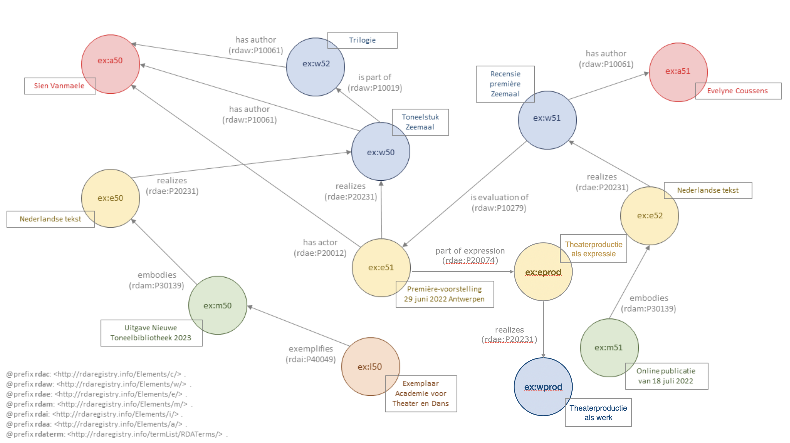

# Zeemaal

Bestand: [10_zeemaal_productie.ttl](10_zeemaal_productie.ttl)

## Entiteitenstructuur

Dit is een nadere reïficatie van [09_zeemaal.ttl](09_zeemaal.ttl) waarbij de productie tot een aparte werk-entiteit gemaakt is. Er ontstaat daarbij ook een bijbehorende expressie-entiteit. Deze expressie-entiteit omvat alle utvoeringen (expressies) van het toneelstuk. 

## Representatie in RDA-RDF

.

Bestand: [10_zeemaal_productie.ttl](10_zeemaal_productie.ttl)